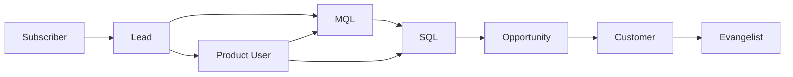

# Configuration des Lifecycle Stages

**Tags :** `hubspot`, `lifecycle`, `funnel`, `CRM`, `growth-ops`
**Dernière mise à jour :** 2026-04-28
**Auteur :** Équipe Growth Ops — ScaleUp Corp

---

## Contexte

Les lifecycle stages dans HubSpot définissent la position d'un contact dans le funnel de conversion. Chez ScaleUp Corp, nous avons personnalisé les stages par défaut pour refléter notre modèle product-led growth (PLG) combiné à un motion sales-assisted.

## Stages configurés



### Définitions détaillées

| Stage | Définition | Critère d'entrée |
|-------|-----------|-------------------|
| **Subscriber** | A souscrit à la newsletter ou au blog | Soumission formulaire newsletter |
| **Lead** | A montré un intérêt initial | Téléchargement contenu, inscription webinar |
| **Product User** | A créé un compte sur la plateforme ScaleUp | Événement `account_created` via API |
| **MQL** | Marketing Qualified Lead | Score ≥ 50 OU demande de démo |
| **SQL** | Sales Qualified Lead | Qualifié par un SDR après premier contact |
| **Opportunity** | Deal créé dans le pipeline | Deal associé au contact |
| **Customer** | A effectué un premier achat/souscription | Deal passé en « Closed Won » |
| **Evangelist** | Client promoteur actif | NPS ≥ 9 ET référencement actif |

## Configuration dans HubSpot

### Étape 1 : Vérifier les stages existants

1. **Paramètres > Objets > Contacts > Lifecycle stage**
2. Vérifier que les stages personnalisés sont bien créés
3. Ordonner les stages selon la progression du funnel

> **⚠️ Attention :** La propriété `lifecyclestage` est une propriété système. Les stages ne peuvent être supprimés une fois créés, seulement masqués. Planifier soigneusement avant d'ajouter un nouveau stage.

### Étape 2 : Configurer les transitions automatiques

Utiliser les workflows pour automatiser les transitions :

**Workflow : Lead → MQL**
```text
Critère d'inscription :
  - hubspot_score ≥ 50
  - lifecyclestage = Lead OU Product User
  
Action :
  - Mettre à jour lifecyclestage = MQL
  - Envoyer notification Slack #sales-alerts
  - Créer tâche SDR : "Qualifier le lead dans les 4h"
```

**Workflow : SQL → Opportunity**
```text
Critère d'inscription :
  - lifecyclestage = SQL
  - Un deal est associé au contact
  
Action :
  - Mettre à jour lifecyclestage = Opportunity
```

**Workflow : Opportunity → Customer**
```text
Critère d'inscription :
  - Deal stage = Closed Won
  
Action :
  - Mettre à jour lifecyclestage = Customer
  - Déclencher séquence onboarding
  - Mettre à jour propriété customer_since = date du jour
```

### Étape 3 : Règles de non-régression

Par défaut, HubSpot empêche la régression d'un lifecycle stage (un Customer ne peut pas redevenir Lead). Ce comportement est recommandé sauf cas spécifiques :

- **Exception gérée par workflow** : Un customer qui churne peut être remis en « Lead » via un workflow dédié avec la propriété `churn_date` renseignée.
- **API override** : L'API permet de forcer la régression si nécessaire.

```bash
# Exemple : forcer la régression via API (endpoint fictif)
curl -X PATCH "https://api.hubspot.fictif.com/crm/v3/objects/contacts/{contactId}" \
  -H "Authorization: Bearer {token}" \
  -H "Content-Type: application/json" \
  -d '{"properties": {"lifecyclestage": "lead"}}'
```

## Bonnes pratiques

1. **Ne pas multiplier les stages** : 6 à 8 stages maximum pour garder la lisibilité.
2. **Documenter chaque transition** : Chaque changement de stage doit avoir un workflow associé et documenté.
3. **Auditer mensuellement** : Vérifier la distribution des contacts par stage pour détecter les anomalies.
4. **Synchroniser avec le CRM** : S'assurer que les stages HubSpot sont alignés avec les statuts dans l'outil de facturation.

## Métriques associées

- **Vélocité du funnel** : Temps moyen entre chaque stage (objectif : Lead → MQL < 14j)
- **Taux de conversion par stage** : MQL → SQL ≥ 25%, SQL → Opportunity ≥ 40%
- **Distribution du funnel** : % de contacts par stage (alerte si > 60% en « Lead »)

---

*Document interne — ScaleUp Corp Growth Ops*
